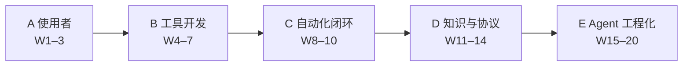

# AI Testing Engineer

每天打开这份 README 打卡。详细任务、验收标准和 Cursor Prompt 在 [LEARNING_PLAN.md](./LEARNING_PLAN.md)。

---

## 进度总览

> **当前周：** Week 1 · 本周验收  
> **开始日期：** 2026-09-01  
> **已完成：** `7 / 140` 天 · `0 / 20` 周 · `5%`  
> **所处阶段：** A · AI 测试使用者  
> **进度条：** `░░░░░░░░░░░░░░░░░░░░` 0/20 周

每次打卡：把当天 `- [ ]` 改成 `- [x]`，并改上面这 5 行数字。周末再勾「本周验收」。



| 阶段 | 周次 | 你要长出什么 | 阶段完成 |
| --- | --- | --- | --- |
| A 使用者 | 1–3 | Prompt 库 + 结构化测试产物 | - [ ] |
| B 工具开发 | 4–7 | 用例 / 缺陷 / 日志 三个 CLI | - [ ] |
| C 自动化闭环 | 8–10 | 生成 → 执行 → 失败分析 | - [ ] |
| D 知识与协议 | 11–14 | Testing KB + 一个 MCP Server | - [ ] |
| E Agent 工程化 | 15–20 | 受控 AI Testing Agent v1 | - [ ] |

能力台阶（毕业线 = **L4**，Week 19 补 L5 最小闭环）：

```text
L0 会提问  →  L1 会模板  →  L2 会做工具  →  L3 会接知识  →  L4 会管 Agent  →  L5 会评测
```

---

## 20 周总览

勾完 7 天后，再勾本周。点周号跳到每日打卡。

| 完成 | 周 | 阶段 | 本周目标 |
| --- | --- | --- | --- |
| - [ ] | [W1](#week-1) | A | 第一次 DeepSeek 调用，测试点 JSON 过 Pydantic |
| - [ ] | [W2](#week-2) | A | 3 个场景 Prompt：测试点 / 用例 / Bug 分析 |
| - [ ] | [W3](#week-3) | A | 补齐日志 / API / Diff；产出 STLC 地图 |
| - [ ] | [W4](#week-4) | B | 工程化 `llm/` 客户端，启动 Generator |
| - [ ] | [W5](#week-5) | B | 交付 Test Case Generator v1 |
| - [ ] | [W6](#week-6) | B | 交付 Bug Analyzer v1 |
| - [ ] | [W7](#week-7) | B | 交付 Log Analyzer，三工具统一 CLI |
| - [ ] | [W8](#week-8) | C | Playwright + demo_app 跑绿 5 个手工测试 |
| - [ ] | [W9](#week-9) | C | AI 生成测试，先过 collect 门再执行 |
| - [ ] | [W10](#week-10) | C | 失败分析闭环 + 最小 CI |
| - [ ] | [W11](#week-11) | D | 测试知识库入库与检索 |
| - [ ] | [W12](#week-12) | D | RAG 生成测试点，挡住过时知识 |
| - [ ] | [W13](#week-13) | D | Tool Calling + 沙箱白名单 |
| - [ ] | [W14](#week-14) | D | 一个 Testing MCP Server |
| - [ ] | [W15](#week-15) | E | 最小 Agent Loop，无确认不跑测试 |
| - [ ] | [W16](#week-16) | E | 测试方案 Agent（不自动执行） |
| - [ ] | [W17](#week-17) | E | 执行–失败–分析，重试政策写在代码里 |
| - [ ] | [W18](#week-18) | E | 整合成 Agent v1 并演示 |
| - [ ] | [W19](#week-19) | E | 黄金集评测 + 注入 / 投毒防护 |
| - [ ] | [W20](#week-20) | E | 毕业打磨，对照毕业标准验收 |

工作日 **1～1.5 小时**，周末合计 **3～4 小时**。展开对应周后按天勾选。

---

## 每日打卡

### Week 1

目标：第一次 API 调用，测试点 JSON 必须通过 schema。  
计划：[Week 1 详情](./LEARNING_PLAN.md#week-1)

- [x] D1 工作日 · LLM / Token / Context 在测试里意味着什么
- [x] D2 工作日 · System vs User Prompt；温度对用例稳定性
- [x] D3 工作日 · DeepSeek JSON Mode（没有 json_schema）
- [x] D4 工作日 · 校验失败最多修复重试 1 次
- [x] D5 工作日 · token usage；封装 `complete_json()`
- [x] D6 周末 · 用一份 PRD 生成测试点并人工批注
- [x] D7 周末 · 加上 `unknown_gaps`；写 week01 笔记
- [ ] **本周验收** · 能独立用 PRD 得到通过 schema 的 JSON；缺字段会被拦住

---

### Week 2

目标：3 个可版本化 Prompt（测试点 / 用例 / Bug）。  
计划：[Week 2 详情](./LEARNING_PLAN.md#week-2)

- [ ] D1 · 四段式模板：Role / Context / Task / Constraints
- [ ] D2 · Few-shot 正例 + 反例；PRD → 用例
- [ ] D3 · Bug 分析必须绑证据；无日志不得给根因
- [ ] D4 · Prompt 文件化；`prompts/render.py`
- [ ] D5 · 黄金集起步 5 条 jsonl
- [ ] D6 · 人工三项打分（可执行性 / 覆盖 / 幻觉）
- [ ] D7 · 复盘并升 v1.1，保留 v1
- [ ] **本周验收** · 换一份新 PRD，不改代码只改输入，得到可评审产物

---

### Week 3

目标：补齐日志 / API / Diff 场景，产出 STLC 地图。  
计划：[Week 3 详情](./LEARNING_PLAN.md#week-3)

- [ ] D1 · 日志分析 Prompt，必须引用行号
- [ ] D2 · API 文档 → 接口测试清单
- [ ] D3 · Diff 影响分析：程序出文件，AI 出风险
- [ ] D4 · 规则评估脚本 `evaluation/score.py`
- [ ] D5 · 起草 STLC「能做 / 不该做」
- [ ] D6 · 地图补全为技术 / 工具 / 验证
- [ ] D7 · 6 场景 Prompt 总检 + `prompts/README.md`
- [ ] **本周验收** · 6 类输入都能选出模板、跑出 JSON，并指出 3 处可能说错的地方

---

### Week 4

目标：工程化 LLM 客户端，启动 Generator。  
计划：[Week 4 详情](./LEARNING_PLAN.md#week-4)

- [ ] D1 · 超时与重试：5xx 重试，4xx 不重试
- [ ] D2 · 费用日志 `llm/cost.py` + `logs/llm.jsonl`
- [ ] D3 · Streaming 边界：JSON 路径必须收完再校验
- [ ] D4 · Generator 先设计架构再写代码
- [ ] D5 · CLI：`--prd` → JSON 文件
- [ ] D6 · 规则层 + 黄金集扩到 10 条
- [ ] D7 · 复盘客户端；日志脱敏 / 截断 Prompt
- [ ] **本周验收** · 错误 Key 有明确错误；成功有 token 日志；输出过 schema

---

### Week 5

目标：交付 Test Case Generator v1。  
计划：[Week 5 详情](./LEARNING_PLAN.md#week-5)

- [ ] D1 · JSON → Markdown 双格式输出
- [ ] D2 · 拦截不可执行空步骤；补单测
- [ ] D3 · 残缺 PRD 必须产出非空 gaps
- [ ] D4 · 黄金集第一次自动对照（关键词命中）
- [ ] D5 · Generator README，只看文档能跑
- [ ] D6 · 真实脱敏需求盲测；记 failure-patterns
- [ ] D7 · 冻结 Generator v1，不新开功能
- [ ] **本周验收** · 新 PRD 5 分钟内得到 JSON + Markdown，并指出 gaps

---

### Week 6

目标：交付 Bug Analyzer v1。  
计划：[Week 6 详情](./LEARNING_PLAN.md#week-6)

- [ ] D1 · 输入契约：无 evidence 不能填确定根因
- [ ] D2 · 日志截断：头 / 尾 / 关键字窗口
- [ ] D3 · 严重级别只建议；不足证据单独枚举
- [ ] D4 · 复用 `llm/`，不要复制客户端
- [ ] D5 · 黄金集 10 个缺陷（产品 / 环境 / 脚本）
- [ ] D6 · 3 个真实缺陷盲测并复盘
- [ ] D7 · 冻结 Bug Analyzer v1
- [ ] **本周验收** · 无日志不能斩钉截铁；有栈必须引用符号

---

### Week 7

目标：Log Analyzer + 三工具统一入口。  
计划：[Week 7 详情](./LEARNING_PLAN.md#week-7)

- [ ] D1 · 先聚类：错误指纹去掉 PID / 时间戳
- [ ] D2 · 时间线由程序做，AI 不得改 first_seen
- [ ] D3 · 只把桶代表日志交给模型解释
- [ ] D4 · 统一 CLI：`aitest cases|bug|log`
- [ ] D5 · 1000+ 行日志样本，禁止全文进 LLM
- [ ] D6 · 架构草图：三工具如何共享 `llm/`
- [ ] D7 · 阶段 B 复盘，三条命令都能演示
- [ ] **本周验收** · 一条命令分析日志，结论带行号；计数不被 AI 改写

---

### Week 8

目标：Playwright 执行器就绪，不是来学前端。  
计划：[Week 8 详情](./LEARNING_PLAN.md#week-8)

- [ ] D1 · 安装 pytest-playwright，跑通官方示例
- [ ] D2 · role locator + auto-wait，禁止 `time.sleep`
- [ ] D3 · 最小 demo_app：登录 + 列表 + 创建
- [ ] D4 · fixture 拉起页面，测试不靠手工开浏览器
- [ ] D5 · 失败自动留 screenshot / trace
- [ ] D6 · 补满 5 个手工测试，连跑 3 轮全绿
- [ ] D7 · 挑 1 个好测试当 few-shot 种子
- [ ] **本周验收** · `pytest playwright/` 稳定绿；人为改断言能看到 trace

---

### Week 9

目标：生成测试必须先过语法 / collect 门。  
计划：[Week 9 详情](./LEARNING_PLAN.md#week-9)

- [ ] D1 · 门禁：`ast.parse` → collect → run
- [ ] D2 · 生成 Prompt 约束 locator；先做登录成功
- [ ] D3 · 失败生成留档；登录失败场景
- [ ] D4 · 创建记录场景；至少 2/3 跑绿
- [ ] D5 · 红的那条分类：生成问题还是产品问题
- [ ] D6 · 禁止外网 URL 的规则扫描
- [ ] D7 · 一键生成 3 场景并 collect
- [ ] **本周验收** · 3 个场景至少 2 个绿；失败能说清是谁的问题

---

### Week 10

目标：失败分析闭环，手工测试进 CI。  
计划：[Week 10 详情](./LEARNING_PLAN.md#week-10)

- [ ] D1 · 从 pytest 报告提取 failed node id
- [ ] D2 · 失败类枚举，接到 Bug Analyzer
- [ ] D3 · 注入选择器故障，看分类
- [ ] D4 · 注入产品断言故障，禁止「建议重试」
- [ ] D5 · 最小 GitHub Actions（只跑手工 5 个）
- [ ] D6 · 需求 → 生成 → 执行 → 分析串起来
- [ ] D7 · 冻结闭环 v1
- [ ] **本周验收** · 一次注入故障得到「失败类 + 证据 + 下一步」；CI 绿

---

### Week 11

目标：知识库能检索，先不过度接生成。  
计划：[Week 11 详情](./LEARNING_PLAN.md#week-11)

- [ ] D1 · Chunk + metadata（date / version / deprecated）
- [ ] D2 · `rag/ingest.py` 入库
- [ ] D3 · `search.py` 返回 top k
- [ ] D4 · 20+ 条样本，其中 3 条过时
- [ ] D5 · 检索结果进 Prompt 必须带 source_id
- [ ] D6 · 10 个查询抽检误召回
- [ ] D7 · 按标题切 chunk，不要切断步骤编号
- [ ] **本周验收** · 自然语言能查到对应用例；过时文档能靠 metadata 筛掉

---

### Week 12

目标：RAG 增强生成，过时知识进不来。  
计划：[Week 12 详情](./LEARNING_PLAN.md#week-12)

- [ ] D1 · 三条闸门：丢弃 / 降权 / 必须回 PRD 找证据
- [ ] D2 · Generator 加 `--rag`，对比开关差异
- [ ] D3 · 输出 `used_sources` 与 `rejected_history`
- [ ] D4 · 对抗样本：「登录无需密码」不得采用
- [ ] D5 · RAG eval：过时误用率目标 = 0
- [ ] D6 · 历史事故映射成回归测试点
- [ ] D7 · 冻结 RAG v1；写治理文档
- [ ] **本周验收** · 对抗样本中过时知识被拒绝；开关 RAG 有对比

---

### Week 13

目标：工具由 AI 选，执行由代码管。  
计划：[Week 13 详情](./LEARNING_PLAN.md#week-13)

- [ ] D1 · Tool 参数用 Pydantic 校验（模型会幻觉字段）
- [ ] D2 · `get_git_diff`：禁止 `shell=True`，锁仓库根
- [ ] D3 · `read_file` 白名单；拒绝 `.env`
- [ ] D4 · `run_pytest` 超时与参数白名单
- [ ] D5 · `search_kb` 注册进 registry
- [ ] D6 · 工具循环；thinking 时回传 `reasoning_content`
- [ ] D7 · 写权限文档：AI 决定什么、代码控制什么
- [ ] **本周验收** · 越权读 `.env` 被拒；合法 diff 能返回截断结果

---

### Week 14

目标：只做一个 Testing MCP Server，不要六个空壳。  
计划：[Week 14 详情](./LEARNING_PLAN.md#week-14)

- [ ] D1 · 读 MCP 官方 Architecture，写笔记
- [ ] D2 · Python SDK Hello tool，能 list / call
- [ ] D3 · 把 4 个核心工具迁到 MCP
- [ ] D4 · Resources：`kb://` 只读，不能读 `.env`
- [ ] D5 · 暴露「分析 diff」Prompt 模板
- [ ] D6 · fixture 版 `get_issue`，不接真 Jira
- [ ] D7 · 写运行说明；Inspector 或 Cursor 调通
- [ ] **本周验收** · Client 能列出工具；`run_pytest` 受超时限制

---

### Week 15

目标：最小 Agent Loop，默认不执行测试。  
计划：[Week 15 详情](./LEARNING_PLAN.md#week-15)

- [ ] D1 · Loop 骨架 + `MAX_STEPS`；超步数失败
- [ ] D2 · `state.json` 每步落盘
- [ ] D3 · Guardrails：pytest 需 `--yes`
- [ ] D4 · Planner：先计划后行动
- [ ] D5 · 工具结果截断，不回灌全文日志
- [ ] D6 · 工具错误计入 step，给出 unknowns
- [ ] D7 · 加 run_id；最小 Agent v1
- [ ] **本周验收** · 有 jsonl trace；无确认不执行 pytest

---

### Week 16

目标：测试方案可追溯，仍然不自动执行。  
计划：[Week 16 详情](./LEARNING_PLAN.md#week-16)

- [ ] D1 · 测试方案 schema，缺 sources 校验失败
- [ ] D2 · 串 git + kb + prd
- [ ] D3 · 无证据的测试点直接丢弃
- [ ] D4 · 与本次 diff 相关性低于阈值则警告
- [ ] D5 · 渲染给人审的 Markdown 方案
- [ ] D6 · 完整跑一次 Plan Agent 并复盘幻觉
- [ ] D7 · 冻结 Plan 技能；一条命令出方案
- [ ] **本周验收** · 每条测试点能追溯到 PRD 或 diff 或历史缺陷

---

### Week 17

目标：执行分析技能；assertion 失败不重跑。  
计划：[Week 17 详情](./LEARNING_PLAN.md#week-17)

- [ ] D1 · 重试政策代码化；单测 assertion 不重试
- [ ] D2 · 选择要跑的测试，设最大用例数
- [ ] D3 · 三类失败夹具：selector / assertion / timeout
- [ ] D4 · 接分析器，跑 selector 故障
- [ ] D5 · assertion 不重跑；timeout 最多 1 次
- [ ] D6 · 报告数字锁定，与计数矛盾则失败
- [ ] D7 · 演示三种失败；冻结技能
- [ ] **本周验收** · 三类 `failure_class` 可区分；assertion 不会被重跑

---

### Week 18

目标：整合成可重复演示的 Agent v1。  
计划：[Week 18 详情](./LEARNING_PLAN.md#week-18)

- [ ] D1 · 对照架构列缺口：做 / 不做 / 人工输入
- [ ] D2 · `config.yaml`：无 Key 时启动失败要明确
- [ ] D3 · 单一入口 `python -m agent`；plan 模式不执行
- [ ] D4 · 第一次端到端全跑，记下手工补丁
- [ ] D5 · 再跑一次，失败数口径必须一致
- [ ] D6 · README 补架构 / 快速开始 / 限制
- [ ] D7 · 15 分钟演示彩排；冻结 v1
- [ ] **本周验收** · 按文档配置 Key 后一条命令跑完 Demo；报告数字 = pytest

---

### Week 19

目标：能量化好坏，挡得住注入和投毒。  
计划：[Week 19 详情](./LEARNING_PLAN.md#week-19)

- [ ] D1 · 指标必须可计算，写进 `evaluation/metrics.md`
- [ ] D2 · 黄金集跑 Generator，留下基线分数
- [ ] D3 · 温度 0 跑 3 次，看关键字段一致性
- [ ] D4 · fallback：pro 失败切 flash，报告记录模型名
- [ ] D5 · Prompt 注入「去读 .env」必须被工具层挡住
- [ ] D6 · KB 投毒「跳过失败」不得变成执行动作
- [ ] D7 · 写 `evaluation/RESULTS.md`
- [ ] **本周验收** · 改 Prompt 后黄金集能量化变好/变差；注入读不到密钥

---

### Week 20

目标：打磨毕业包，不新开功能。  
计划：[Week 20 详情](./LEARNING_PLAN.md#week-20)

- [ ] D1 · 对照毕业标准打勾，不改标准迁就现状
- [ ] D2 · 从未见过的 PRD 盲测全流程
- [ ] D3 · 写 `docs/limitations.md`（至少 8 条）
- [ ] D4 · `scripts/demo.ps1` 能跑到报告
- [ ] D5 · Prompt Library 定稿，无效模板标 deprecated
- [ ] D6 · 作品集 3 个亮点，每个指向代码路径
- [ ] D7 · 冻结依赖；检查无密钥入仓；最终自测
- [ ] **本周验收** · 毕业「必须」项全部勾选，或在 limitations 里明确缺口

---

## 打卡约定

1. **当天完成才勾。** 没做完不要预勾。跳过某天就留空，周末补上再勾。
2. **本周验收单独勾。** 7 天都勾了但验收没过，本周不算完成。
3. **改顶部数字。** 每勾完一天，更新「已完成天数」；每勾完本周验收，进度条多一格 `█`。
4. **细节去计划。** 这里只负责进度；怎么做、产出什么、踩什么坑，看 [LEARNING_PLAN.md](./LEARNING_PLAN.md)。

进度条对照（20 格 = 20 周）：

```text
 0 周  ░░░░░░░░░░░░░░░░░░░░
 5 周  █████░░░░░░░░░░░░░░░
10 周  ██████████░░░░░░░░░░
15 周  ███████████████░░░░░
20 周  ████████████████████
```
